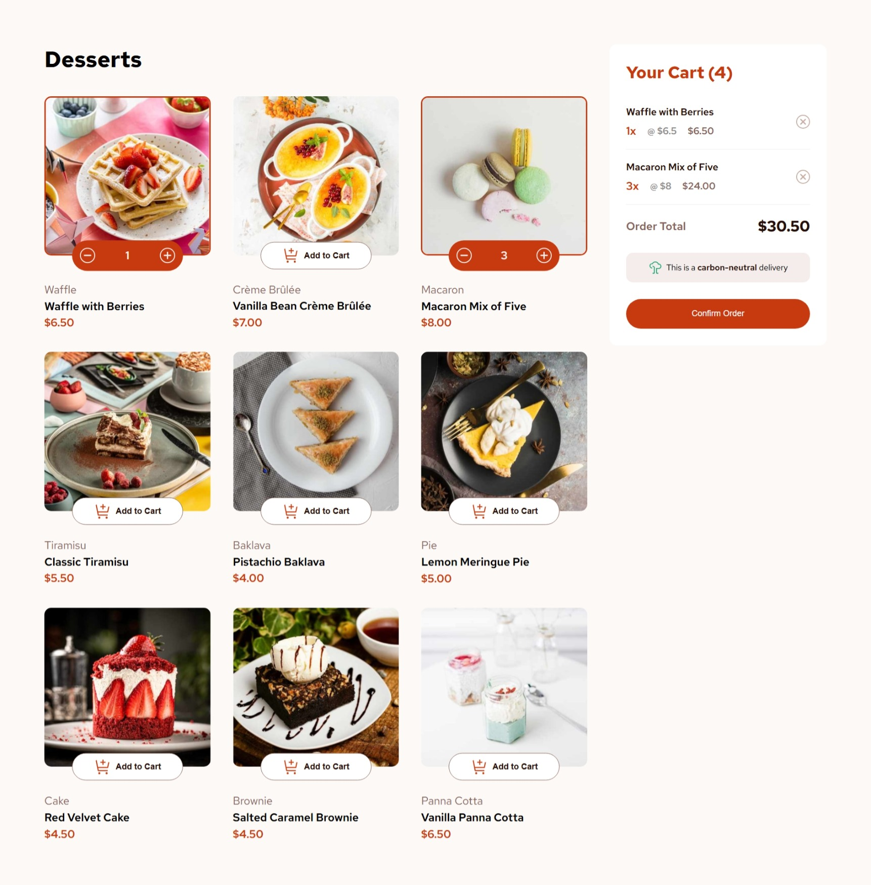
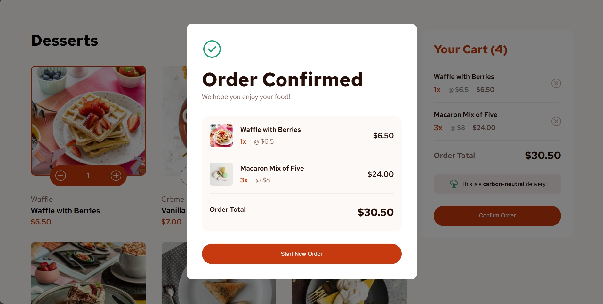

# Frontend Mentor - Product list with cart solution

## Table of contents

- [Overview](#overview)
  - [The challenge](#the-challenge)
  - [Screenshot](#screenshot)
  - [Links](#links)
  - [Built with](#built-with)
  - [What I learned](#what-i-learned)
  - [Useful resources](#useful-resources)
  - [AI Collaboration](#ai-collaboration)
- [Author](#author)

---

## Overview

This is a solution to the [Product list with cart challenge on Frontend Mentor](https://www.frontendmentor.io/challenges/product-list-with-cart-5MmqLVAp_d). Frontend Mentor challenges help you improve your coding skills by building realistic projects.

### The challenge

Users should be able to:

- Add items to the cart and remove them
- Increase/decrease the number of items in the cart
- See an order confirmation modal when they click "Confirm Order"
- Reset their selections when they click "Start New Order"
- View the optimal layout for the interface depending on their device's screen size
- See hover and focus states for all interactive elements on the page
- Have their cart persist across page refreshes via localStorage

### Screenshot




### Links

- Live Site URL: [dessertlist.vercel.app](https://dessertlist.vercel.app)

---

### Built with

- Semantic HTML5 markup
- CSS custom properties
- Flexbox
- CSS Grid
- Mobile-first workflow
- Google fonts (https://fonts.google.com/)
- [React](https://reactjs.org/) - JS library
- [Vite](https://vitejs.dev/) - Build tool and dev server
- [Lucide React](https://lucide.dev/) - Icon library

### What I learned

**Responsive images with `<picture>`**

One of the bigger performance wins was properly implementing responsive images. Instead of serving a large desktop image to all screen sizes, I used the `<picture>` element with multiple `<source>` tags to serve the right image at the right breakpoint:

```jsx
<picture>
  <source media="(min-width: 1024px)" srcSet={food.image.desktop} />
  <source media="(min-width: 640px)" srcSet={food.image.tablet} />
  
</picture>
```

using `fetchPriority="high"` on the first image (the LCP element) improves perceived load time.

**Cart state with localStorage persistence**

I used a lazy initializer in `useState` to hydrate cart state from localStorage on first render, avoiding an extra re-render:

```js
const [foodItem, setFoodItem] = useState(() => {
  const stored = localStorage.getItem("foodItem");
  return stored ? JSON.parse(stored) : [];
});
```

**Deduplicating cart items for display**

Since the cart stores one object per item instance (to track quantity via array length), I needed a clean way to deduplicate for the order summary and modal. Using `Map` keyed by item name does this in one line:

```js
const uniqueItems = [
  ...new Map(foodItem.map((item) => [item.name, item])).values(),
];
```

**Component decomposition**

I broke a large single-file component into focused, reusable pieces — `FoodCard`, `FoodGrid`, `QuantityControl`, `OrderSummary`, `OrderItem`, `OrderSection`, `OrderModal`, and `ModalItem`. Each component has a single responsibility and receives only the props it needs, making the codebase much easier to reason about and maintain.

### Continued development

- Migrate cart state to a React Context or Zustand store to avoid prop drilling through the component tree
- Add keyboard navigation support for the quantity controls
- Explore animating the cart item additions and modal entrance for a more polished UX
- Convert images to WebP format for further performance improvements
- Add unit tests for the cart logic (add, increment, decrement, remove)

### Useful resources

- [web.dev - Responsive images](https://web.dev/learn/design/responsive-images) - Comprehensive guide that helped me understand `srcset`, `sizes`, and the `<picture>` element properly
- [web.dev - Optimize LCP](https://web.dev/articles/optimize-lcp) - Helped me understand `fetchPriority` and how to reduce Largest Contentful Paint
- [MDN - Array.findLastIndex](https://developer.mozilla.org/en-US/docs/Web/JavaScript/Reference/Global_Objects/Array/findLastIndex) - Used for the cart decrement logic to remove only the last instance of an item

### AI Collaboration

I used **Claude (Anthropic)** throughout this project as a development aid.

- **Performance optimization** — Claude helped me interpret Lighthouse audit warnings and implement fixes, including responsive images with `<picture>`, `fetchPriority` for the LCP image, `loading="lazy"` for below-fold images, and `width`/`height` attributes to eliminate layout shift.
- **Component refactoring** — After building the core functionality in a single component, I worked with Claude to identify clean component boundaries and split the code into focused, reusable pieces.

What worked well: using Claude to explain _why_ a warning existed, not just what to change

---

## Author

- Frontend Mentor - [@Gt1code](https://www.frontendmentor.io/profile/Gt1code)
- GitHub - [@Gt1code](https://github.com/Gt1code)
